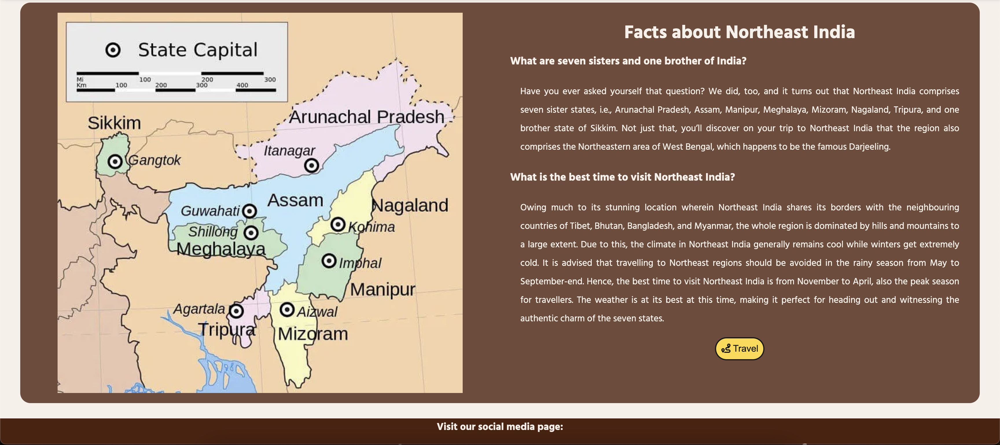
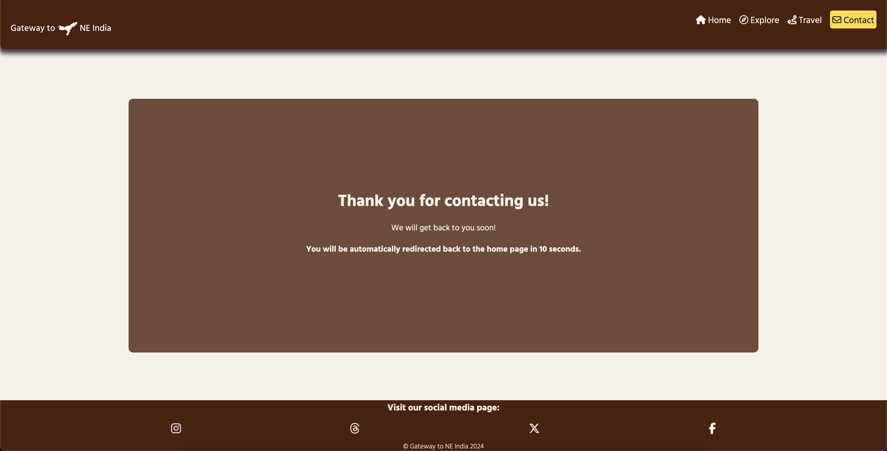
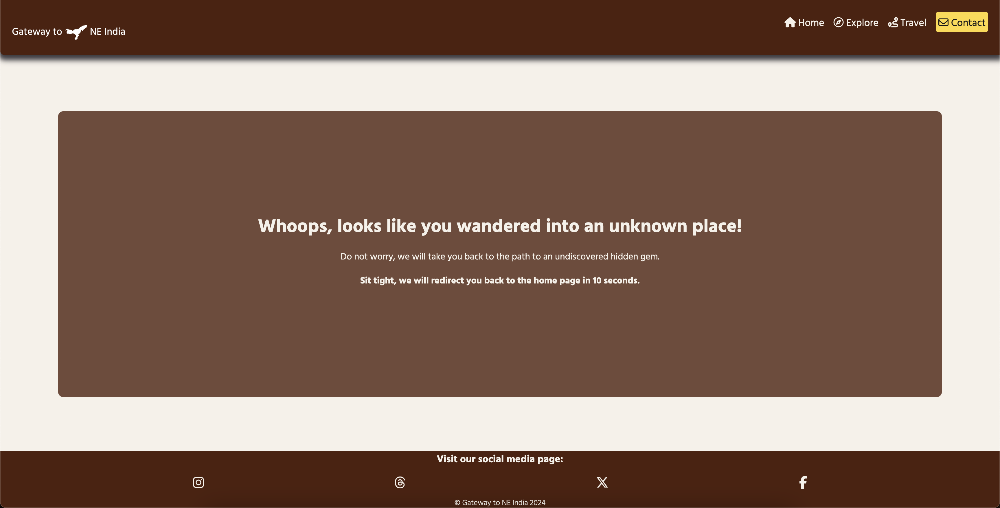

# [GATEWAY TO NE INDIA](https://robizman.github.io/gateway-to-neindia/)

### Introduction

Dive into the world of Northeast India at "Gateway to NE India", your comprehensive source for everything. The goal of this project is to offer current and thorough travel information on the stunning and varied Northeast region of India, comprising the states of Arunachal Pradesh, Assam, Manipur, Meghalaya, Mizoram, Nagaland, and Tripura.

The project's primary objective is to develop a captivating, user-friendly, and informative website that serves as a dependable source for promoting Northeast India's cultural heritage, natural beauty, and distinctive attractions to entice travellers to explore India's hidden treasures. Additionally, this project marks the beginning of five portfolio projects for the Code Institute’s full-stack software development course.

#### Target Audience ⁤

The website is designed to accommodate a diverse audience. It is tailored for adventure seekers and culture enthusiasts who are interested in exploring unknown places and learning about the diverse cultures and traditions of Northeast India. The website extends a cordial invitation to international and domestic tourists who are eager to learn about India's hidden gems and offers comprehensive details.

#### Value Proposition ⁤

"Gateway to NE India" ensures users have access to trustworthy and up-to-date information about Northeast India's tourism, including cultural insights, local attractions, and recommendations. Moreover, the website offers a delightful browsing experience with its user-friendly interface and engaging content that informs and engages users.

Be a part of this exciting journey and uncover the hidden gems of Northeast India with us!


[Click here to view the Live website](https://robizman.github.io/gateway-to-neindia/)

## UX

In this project, I follow the Five Planes of User Experience model invented by Jesse James Garrett.

### Five Planes of User Experience

This model aids in transforming from abstract ideas, such as creating objectives of the project and identifying the user needs, to concrete concepts, such as assembling visual elements together to produce the visual design of the idea to meet the project's objectives and users' needs.

#### The Strategy Plane

Due to a narrow passage of deadlocked countries (Nepal, Bhutan, Bangladesh, Myanmar, and China), Northeast India is often a forgotten region. However, they preserved a rich, unique culture and heritage, which received little or no attention from the general population and tourists. Most recently, Northeast India has slowly brought attention to local and international tourism. Still, they have been plagued with a lack of awareness about seven states of Northeast India plus one state.

The users often need to find quick and relevant information about tourism in Northeast India. Therefore, the main objective of this project is to create a website that makes it a one-stop for all relevant information regarding the region and make the website a home for users to raise awareness about potential tourism in Northeast India. Thus, this project aims to meet the business and the user's needs.

#### The Scope Plane

Based on the main objective and goals set out in the Strategy Plane, these requirements for developing the website are broken down into two categories:

##### Content requirements:
- Information about Northeast India
- Visual facts about Northeast India
- State profile
- Each state's facts

##### Functionality requirements:
- Easy navigation on the site to find the relevant information they are looking for.
Highlight the navigation where they are on the page.
- A button leads the user to visit the appropriate page for more information.
- A contact form for users to send a message.

#### The Structure Plane

The requirements outlined in the Scope Plane were then used to create a structure for the website. A site map below shows how users can navigate the website easily.


#### The Skeleton Plane

Please refer to the [Wireframes](#Wireframes) section for more detailed wireframing.

#### The Surface Plane

[Click here to view the live site.](https://robizman.github.io/gateway-to-neindia/)

### Colour Scheme

I used [Color Hunt](https://colorhunt.co/palette/4f200dffd93df6f1e9191919) to generate my colour palette


The colour palette represents the earthy and sunny Northeast India, making the website feel more earthy and easy for people to browse. However, it was crucial for the colour palette to pass the minimum colour contrast set by the Web Content Accessibility Guide (WCAG). The colour palette was tested using [Coolors' Color Contrast Checker](https://coolors.co/contrast-checker/). The result below shows that these colours passed the minimum WCAG contrast ratio.

<details>
<summary>Color Contrast Checker</summary>


</details>

<br>
I have used CSS `:root` variables to easily update the global colour scheme by changing only one value, instead of everywhere in the CSS file.

```css
:root {
    --brown: #4F200D;
    --yellow: #FFD93D;
    --white: #F6F1E9;
    --grey: #3D3B40;
    --black: #191919;
}
```

### Typography

Hind Vadodara was chosen as the main font for the whole website. The font was imported from Google Fonts. The font makes the website look and feel very Indian.

Sans-serif was used as a step-back font if Hind Vadodara failed to load on the website.

## User Stories
### New Site Users

- As a new site user, I want to understand the site's purpose easily so that I can decide if it is useful.

- As a new site user, I want to navigate the site intuitively so that I can find the information I seek.

- As a new site user, I want to learn about the culture and attractions of Northeast India so that I can plan my trip.


### Returning Site Users

- As a returning user, I want to access the site from my mobile device so that I can plan my trip on the go.

- As a returning user, I want to see each state's facts and recommendations so that I can visit unique places based on these recommendations.

- As a returning user, I want to be able to contact the site owner so that I can ask questions.

## Wireframes

To follow best practice, wireframes were developed for mobile, tablet, and desktop sizes.

I have used [Balsamiq](https://balsamiq.com/wireframes) to design my site wireframes.

### Mobile Wireframes
<details>
<summary>Mobile Wireframes</summary>


</details>

### Tablet Wireframes
<details>
<summary>Tablet Wireframes</summary>


</details>

### Desktop Wireframes
<details>
<summary>Desktop Wireframes</summary>


</details>

## Features

### Existing Features

#### The Home Page
The Home Page is the first contact users will encounter when visiting this website. The page appears with the title welcoming users to the website with a slogan used to retain the users' engagement. In addition, a video background gives users the feel of the mother nature of Northeast India. Also, there is a button that leads users to the Explore page. [Click here to view the home page](https://robizman.github.io/gateway-to-neindia/index.html)


#### Header & Navigation Menu

At the top of the website is the header, where users can see the company's logo on the left and the fixed navigation menu on the right side, which was made to be fully responsive across different device sizes. In addition, the navigation menu is hidden on a mobile device, and the hamburger icon allows users to open and close the navigation menu.

- Desktop version


- Tablet version


- Mobile version


#### Footer

The footer is at the bottom of the website, where users can visit the company's social media presence. The copyright message is located below social media icons.

- Desktop version


- Tablet version


- Mobile version


#### The Explore page

The Explore page breaks down into two sections: Seven sisters and one brother section, and facts about Northeast India. An image of the costumes of seven sisters and one brother is attached to the first section, and a map image of Northeast India is attached to the second section. A visual explanation helps users make sense of Northeast India's background. Finally, there is a button that leads users to the Travel page. [Click here to view the Explore page](https://robizman.github.io/gateway-to-neindia/explore.html)




#### The Travel page

The Travel page also breaks down into two sections: Assam and Meghalaya. This page provides users with an overview of each state of Northeast India with plenty of facts and recommendations to visit places. [Click here to view the Travel page](https://robizman.github.io/gateway-to-neindia/travel.html)


#### The Contact page

The Contact page features a contact form for users to input their first name, surname, email address, and message. This page enables users to contact the website's owner directly. Also, there is a button that users need to click to send their form to the website's owner. [Click here to view the Contact page](https://robizman.github.io/gateway-to-neindia/contact.html)


#### The Confirmation page

Once a user submits the contact form, they will go to the confirmation page to confirm that their contact form was submitted successfully. The users will be redirected to the home page automatically after 10 seconds. [Click here to view the Confirmation page](https://robizman.github.io/gateway-to-neindia/confirmation.html)



#### The 404 Error page

If the user inputs the incorrect URL address, the 404 error page will appear and redirect the user back to the home page automatically after 10 seconds. [Click here to view the 404 Error page](https://robizman.github.io/gateway-to-neindia/404.html)



### Future features

- The remaining states of Northeast India shall be added to the Travel page.
- The Travel page will have its own dropdown menu for each state of Northeast India, as the travel information for each state will be extensive.
- The dark mode toggle shall be implemented on the website to give users an option to enable a dark mode on this website.
- Implement DeepL's or Google Translate's direct translation across the website using API.
- Introduce an AI-powered chatbot across the website to make users feel they are conversing with someone about Northeast India at the basic level.
- Introduce an AI-powered travel plan generator to allow users to generate their travel plans on their visit to Northeast India.

## Tools & Technologies Used

- [HTML](https://en.wikipedia.org/wiki/HTML) used for the main site content.
- [CSS](https://en.wikipedia.org/wiki/CSS) used for the main site design and layout.
- [CSS :root variables](https://www.w3schools.com/css/css3_variables.asp) used for reusable styles throughout the site.
- [CSS Flexbox](https://www.w3schools.com/css/css3_flexbox.asp) used for an enhanced responsive layout.
- [Git](https://git-scm.com) used for version control. (`git add`, `git commit`, `git push`)
- [GitHub](https://github.com) used for secure online code storage.
- [GitHub Pages](https://pages.github.com) used for hosting the deployed front-end site.
- [Gitpod](https://gitpod.io) used as a cloud-based IDE for development.
- [CodePen](https://codepen.io/) used for toying and testing with CSS design before committing changes to the actual website design.

## Deployment

The site was deployed to GitHub Pages. The steps to deploy are as follows:

- In the [GitHub repository](https://github.com/RoBizMan/gateway-to-neindia), navigate to the Settings tab 
- From the source section drop-down menu, select the **Main** Branch, then click "Save".
- The page will be automatically refreshed with a detailed ribbon display to indicate the successful deployment.

The live link can be found [here](https://robizman.github.io/gateway-to-neindia)

### Local Deployment

This project can be cloned or forked in order to make a local copy on your own system.

#### Cloning

You can clone the repository by following these steps:

1. Go to the [GitHub repository](https://github.com/RoBizMan/gateway-to-neindia) 
2. Locate the Code button above the list of files and click it 
3. Select if you prefer to clone using HTTPS, SSH, or GitHub CLI and click the copy button to copy the URL to your clipboard
4. Open Git Bash or Terminal
5. Change the current working directory to the one where you want the cloned directory
6. In your IDE Terminal, type the following command to clone my repository:
	- `git clone https://github.com/RoBizMan/gateway-to-neindia.git`
7. Press Enter to create your local clone.

Alternatively, if using Gitpod, you can click below to create your own workspace using this repository.

#### Forking

By forking the GitHub Repository, we make a copy of the original repository on our GitHub account to view and/or make changes without affecting the original owner's repository.
You can fork this repository by using the following steps:

1. Log in to GitHub and locate the [GitHub Repository](https://github.com/RoBizMan/gateway-to-neindia)
2. At the top of the Repository (not top of page) just above the "Settings" Button on the menu, locate the "Fork" Button.
3. Once clicked, you should now have a copy of the original repository in your own GitHub account!

### Local VS Deployment

There was no difference between local and deployment noticed.

## Credits

### Content

| Source | Location | Notes |
| --- | --- | --- |
| [Markdown Builder](https://tim.2bn.dev/markdown-builder) | README and TESTING | tool to help generate the Markdown files |
| [freeCodeCamp](https://www.freecodecamp.org/news/how-to-write-better-git-commit-messages/) | version control | "How to Write Better Git Commit Messages - A Step-By-Step Guide" |
| [W3Schools](https://www.w3schools.com/howto/howto_js_topnav_responsive.asp) | entire site | responsive HTML/CSS navbar |
| [Victor Copque](https://codepen.io/victorcopque/pen/OVxRbq?editors=1100) | entire site | responsive HTML/CSS navbar with hover effect |
| [Edward Ezekiel](https://codepen.io/edezekiel/pen/drrQzP?editors=1100) | entire site | responsive toggle menu |
| [W3Schools](https://www.w3schools.com/css/css3_variables.asp) | entire site | how to use CSS :root variables |
| [Flexbox Froggy](https://flexboxfroggy.com/) | entire site | modern responsive layouts |
| [Code Boxx](https://dev.to/codeboxx/responsive-logo-in-html-css-55ji) | entire site | responsive logo |
| [CodeWithRandom](https://www.codewithrandom.com/2022/09/07/create-text-over-video-using-html-and-css-source-code/) | landing/home page | background video with text overlay in the front |
| [Mozilla mdn](https://developer.mozilla.org/en-US/docs/Web/CSS/@keyframes) | entire site | @keyframes animation for opening toggle menu (easeIn)|
| [HubSpot](https://blog.hubspot.com/website/css-fade-in) | landing/home page | @keyframes animation for welcome message on the landing page (fadeIn) |
| [HubSpot](https://blog.hubspot.com/website/center-an-image-in-html#) | entire site | centring an image/text with the flex property |
| [Google Fonts - Hind Vadodara](https://fonts.google.com/specimen/Hind+Vadodara?query=hind+vadodara) | entire site | Hind Vadodara font used throughout the website |
| [Fontawesome](https://fontawesome.com/) | entire site | icons used throughout the website |
| [Logo](https://logo.com/) | entire site | the company's logo was generated by Logo and used throughout the website, including favicon |

### Media

| Source | Location | Type | Notes |
| --- | --- | --- | --- |
| [Freepik](https://www.freepik.com/free-video/aerial-view-lush-palm-forest_2494877) | landing/home page | video | landing page background video |
| [Untold Facts](https://ikablogger.blog/2023/05/18/unexplored-part-of-india/) | explore page | image | costumes of seven sisters and one brother |
| [Medium](https://sachanswati29.medium.com/explore-the-soul-stirring-states-of-seven-sisters-one-brother-a-neighbor-on-an-epic-north-east-eed8425e8317) | explore page | image | map of Northeast India |
| [Pexels](https://www.pexels.com/photo/food-people-field-countryside-7185237/) | travel page | image | lady plucking tea leaves used for Assam section |
| [Pexels](https://www.pexels.com/photo/krang-shuri-waterfalls-krang-suri-rd-umlarem-meghalaya-india-most-beautiful-falls-in-meghalaya-19469039/) | travel page | image | waterfall with a small lake used for Meghalaya section |
| [TravelTriangle](https://traveltriangle.com/blog/north-east-trip/) | explore/travel page | text | article was copied and pasted into the Explore and Travel pages with minor changes |

### Acknowledgements

- I would like to thank my Code Institute mentor, [Tim Nelson](https://github.com/TravelTimN) for their support and feedback throughout the development of this project.
- I would like to thank the [Code Institute](https://codeinstitute.net) tutor team for their visual guidance and clarifications throughout all concepts I might not have initially understood.
- I would like to thank the [Code Institute Slack community](https://code-institute-room.slack.com) for the moral support; it kept me going during periods of self doubt and imposter syndrome and kept me sane.
- I would like to thank my partner, for believing in me, and encouraging me to make this transition into software development.
- I would like to thank my parents and grandparents for trusting that I could make a smooth transition into a new career pathway.
- I would like to thank my friends for visiting my website and feeding me with their feedback so that I can continue improving/enhancing UX design on my website.