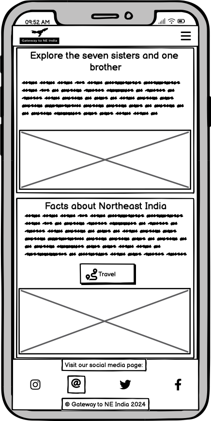
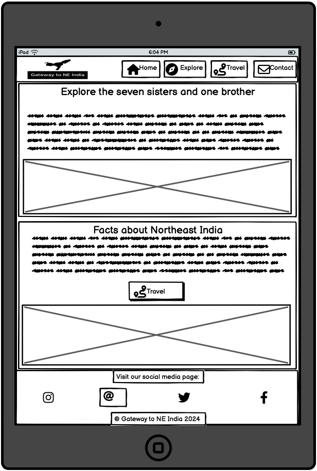

# [GATEWAY TO NE INDIA](https://robizman.github.io/gateway-to-neindia/)

### Introduction

Dive into the world of Northeast India at "Gateway to NE India", your comprehensive source for everything. The goal of this project is to offer current and thorough travel information on the stunning and varied Northeast region of India, comprising the states of Arunachal Pradesh, Assam, Manipur, Meghalaya, Mizoram, Nagaland, and Tripura.

The project's primary objective is to develop a captivating, user-friendly, and informative website that serves as a dependable source for promoting Northeast India's cultural heritage, natural beauty, and distinctive attractions to entice travellers to explore India's hidden treasures. Additionally, this project marks the beginning of five portfolio projects for the Code Institute’s full-stack software development course.

#### Target Audience ⁤

The website is designed to accommodate a diverse audience. It is tailored for adventure seekers and culture enthusiasts who are interested in exploring unknown places and learning about the diverse cultures and traditions of Northeast India. The website extends a cordial invitation to international and domestic tourists who are eager to learn about India's hidden gems and offers comprehensive details.

#### Value Proposition ⁤

"Gateway to NE India" ensures users have access to trustworthy and up-to-date information about Northeast India's tourism, including cultural insights, local attractions, and recommendations. Moreover, the website offers a delightful browsing experience with its user-friendly interface and engaging content that informs and engages users.

Be a part of this exciting journey and uncover the hidden gems of Northeast India with us!

\image of AmIResponsive here

\Link to a live website here

## UX

In this project, I follow the Five Planes of User Experience model invented by Jesse James Garrett.

### Five Planes of User Experience

This model aids in transforming from abstract ideas, such as creating objectives of the project and identifying the user needs, to concrete concepts, such as assembling visual elements together to produce the visual design of the idea to meet the project's objectives and users' needs.

#### The Strategy Plane

Due to a narrow passage of deadlocked countries (Nepal, Bhutan, Bangladesh, Myanmar, and China), Northeast India is often a forgotten region. However, they preserved a rich, unique culture and heritage, which received little or no attention from the general population and tourists. Most recently, Northeast India has slowly brought attention to local and international tourism. Still, they have been plagued with a lack of awareness about seven states of Northeast India plus one state.

The users often need to find quick and relevant information about tourism in Northeast India. Therefore, the main objective of this project is to create a website that makes it a one-stop for all relevant information regarding the region and make the website a home for users to raise awareness about potential tourism in Northeast India. Thus, this project aims to meet the business and the user's needs.

#### The Scope Plane

Based on the main objective and goals set out in the Strategy Plane, these requirements for developing the website are broken down into two categories:

##### Content requirements:
- Information about Northeast India
- Visual facts about Northeast India
- State profile
- Each state's facts

##### Functionality requirements:
- Easy navigation on the site to find the relevant information they are looking for.
Highlight the navigation where they are on the page.
- A button leads the user to visit the appropriate page for more information.
- A contact form for users to send a message.

#### The Structure Plane

The requirements outlined in the Scope Plane were then used to create a structure for the website. A site map below shows how users can navigate the website easily.


#### The Skeleton Plane

Please refer to the [Wireframes](#Wireframes) section for more detailed wireframing.

#### The Surface Plane

[Click here to view the live site.](https://robizman.github.io/gateway-to-neindia/)

### Colour Scheme

I used [Color Hunt](https://colorhunt.co/palette/4f200dffd93df6f1e9191919) to generate my colour palette


The colour palette represents the earthy and sunny Northeast India, making the website feel more earthy and easy for people to browse. However, it was crucial for the colour palette to pass the minimum colour contrast set by the Web Content Accessibility Guide (WCAG). The colour palette was tested using [Coolors' Color Contrast Checker](https://coolors.co/contrast-checker/). The result below shows that these colours passed the minimum WCAG contrast ratio.

<details>
<summary>Color Contrast Checker</summary>


</details>

<br>
I have used CSS `:root` variables to easily update the global colour scheme by changing only one value, instead of everywhere in the CSS file.

```css
:root {
    --brown: #4F200D;
    --yellow: #FFD93D;
    --white: #F6F1E9;
    --grey: #3D3B40;
    --black: #191919;
}
```

### Typography

Hind Vadodara was chosen as the main font for the whole website. The font was imported from Google Fonts. The font makes the website look and feel very Indian.

Sans-serif was used as a step-back font if Hind Vadodara failed to load on the website.

## User Stories
### New Site Users

- As a new site user, I want to understand the site's purpose easily so that I can decide if it is useful.

- As a new site user, I want to navigate the site intuitively so that I can find the information I seek.

- As a new site user, I want to learn about the culture and attractions of Northeast India so that I can plan my trip.


### Returning Site Users

- As a returning user, I want to access the site from my mobile device so that I can plan my trip on the go.

- As a returning user, I want to see each state's facts and recommendations so that I can visit unique places based on these recommendations.

- As a returning user, I want to be able to contact the site owner so that I can ask questions.

## Wireframes

To follow best practice, wireframes were developed for mobile, tablet, and desktop sizes.

I have used [Balsamiq](https://balsamiq.com/wireframes) to design my site wireframes.

### Mobile Wireframes
<details>
<summary>Mobile Wireframes</summary>





</details>

### Tablet Wireframes
<details>
<summary>Tablet Wireframes</summary>





</details>

### Desktop Wireframes
<details>
<summary>Desktop Wireframes</summary>


</details>

## Deployment

The site was deployed to GitHub Pages. The steps to deploy are as follows:

- In the [GitHub repository](https://github.com/RoBizMan/gateway-to-neindia), navigate to the Settings tab 
- From the source section drop-down menu, select the **Main** Branch, then click "Save".
- The page will be automatically refreshed with a detailed ribbon display to indicate the successful deployment.

The live link can be found [here](https://robizman.github.io/gateway-to-neindia)

### Local Deployment

This project can be cloned or forked in order to make a local copy on your own system.

#### Cloning

You can clone the repository by following these steps:

1. Go to the [GitHub repository](https://github.com/RoBizMan/gateway-to-neindia) 
2. Locate the Code button above the list of files and click it 
3. Select if you prefer to clone using HTTPS, SSH, or GitHub CLI and click the copy button to copy the URL to your clipboard
4. Open Git Bash or Terminal
5. Change the current working directory to the one where you want the cloned directory
6. In your IDE Terminal, type the following command to clone my repository:
	- `git clone https://github.com/RoBizMan/gateway-to-neindia.git`
7. Press Enter to create your local clone.

Alternatively, if using Gitpod, you can click below to create your own workspace using this repository.

#### Forking

By forking the GitHub Repository, we make a copy of the original repository on our GitHub account to view and/or make changes without affecting the original owner's repository.
You can fork this repository by using the following steps:

1. Log in to GitHub and locate the [GitHub Repository](https://github.com/RoBizMan/gateway-to-neindia)
2. At the top of the Repository (not top of page) just above the "Settings" Button on the menu, locate the "Fork" Button.
3. Once clicked, you should now have a copy of the original repository in your own GitHub account!

### Local VS Deployment

There was no difference between local and deployment noticed.