# TESTING

Return back to the [README.md](README.md) file.

## Code Validation

### HTML

I have used the recommended [HTML W3C Validator](https://validator.w3.org) to validate all of my HTML files.

| Page | W3C URL | Screenshot | Notes |
| --- | --- | --- | --- |
| Home | [W3C](https://validator.w3.org/nu/?doc=https%3A%2F%2Frobizman.github.io%2Fgateway-to-neindia%2Findex.html) | 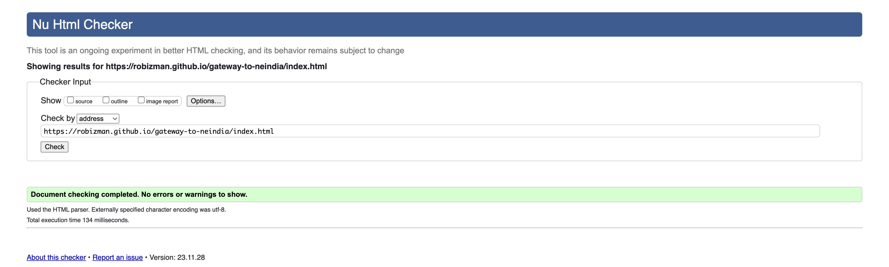 | Pass: No error found |
| Explore | [W3C](https://validator.w3.org/nu/?doc=https%3A%2F%2Frobizman.github.io%2Fgateway-to-neindia%2Fexplore.html) | 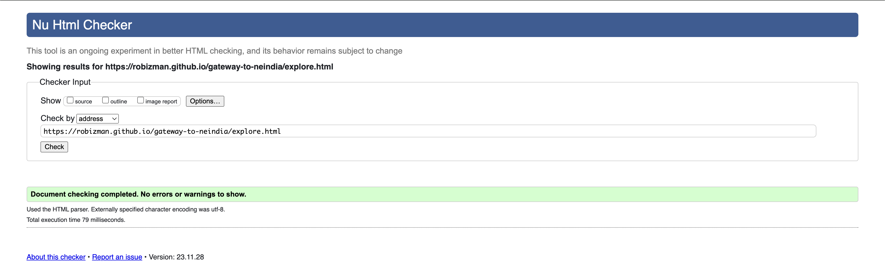 | Pass: No error found |
| Travel | [W3C](https://validator.w3.org/nu/?doc=https%3A%2F%2Frobizman.github.io%2Fgateway-to-neindia%2Ftravel.html) | 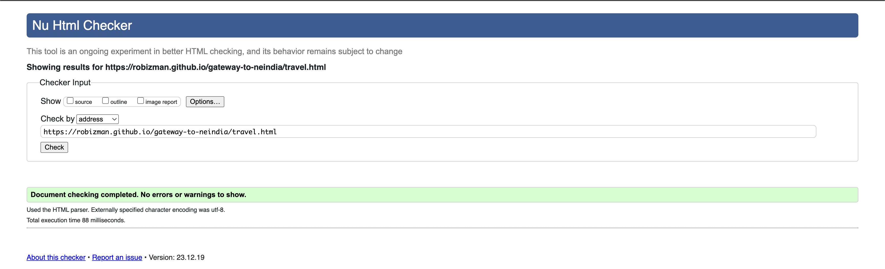 | Pass: No error found |
| Contact | [W3C](https://validator.w3.org/nu/?doc=https%3A%2F%2Frobizman.github.io%2Fgateway-to-neindia%2Fcontact.html) | 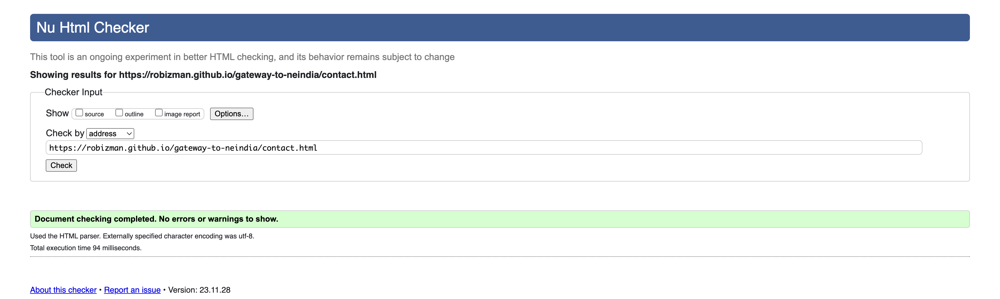 | Pass; No error found |
| Confirmation | [W3C](https://validator.w3.org/nu/?doc=https%3A%2F%2Frobizman.github.io%2Fgateway-to-neindia%2Fconfirmation.html) |  | No error found |
| 404 | [W3C](https://validator.w3.org/nu/?doc=https%3A%2F%2Frobizman.github.io%2Fgateway-to-neindia%2F404.html) |  | Pass: No error found |

### CSS

I have used the recommended [CSS Jigsaw Validator](https://jigsaw.w3.org/css-validator) to validate all of my CSS files.

| File | Jigsaw URL | Screenshot | Notes |
| --- | --- | --- | --- |
| style.css | [Jigsaw](https://jigsaw.w3.org/css-validator/validator?uri=https%3A%2F%2Frobizman.github.io%2Fgateway-to-neindia%2F&profile=css3svg&usermedium=all&warning=1&vextwarning=&lang=en) |  | Pass: No error found |

## Browser Compatibility

I have tested my deployed project on multiple browsers to check for compatibility issues.

| Browser | Home | Explore | Travel | Contact | Confirmation | 404 | Notes |
| --- | --- | --- | --- | --- | --- | --- | --- |
| Chrome |  | 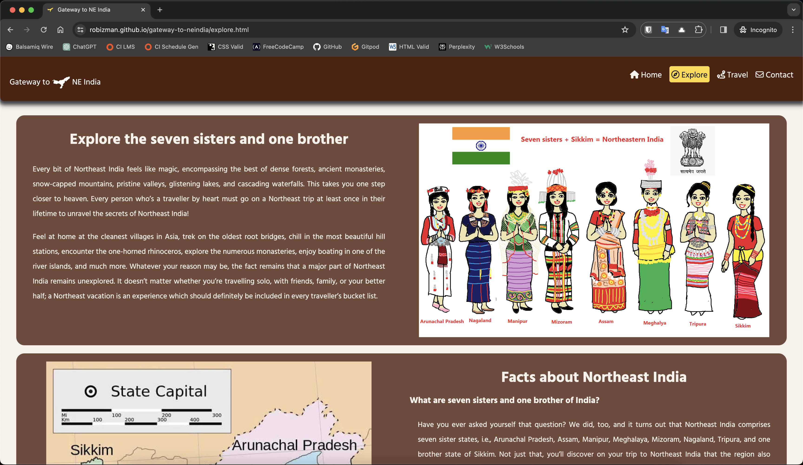 | 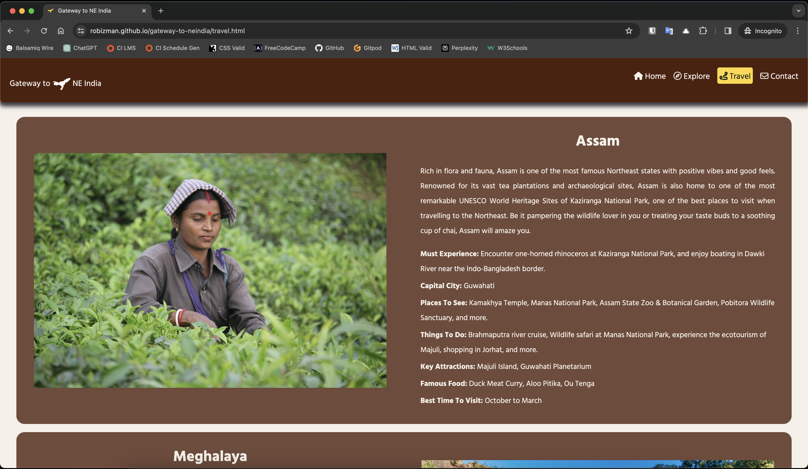 | 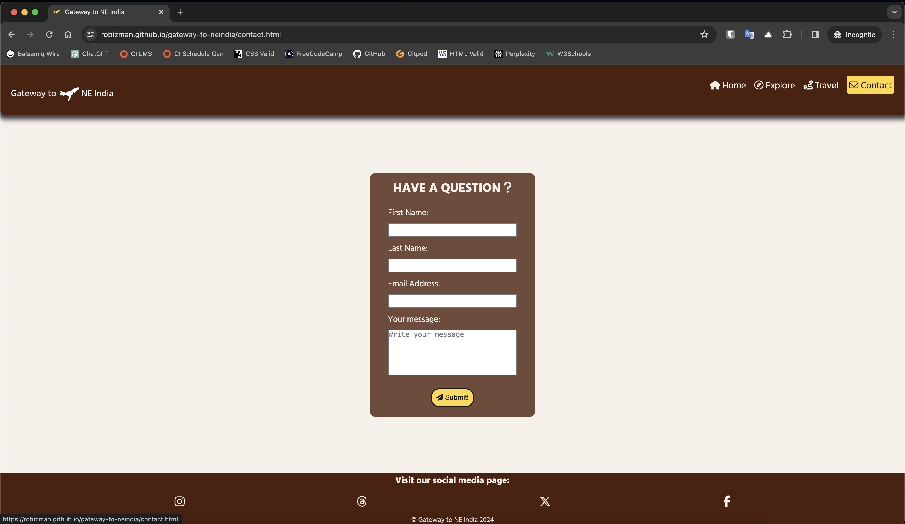 | 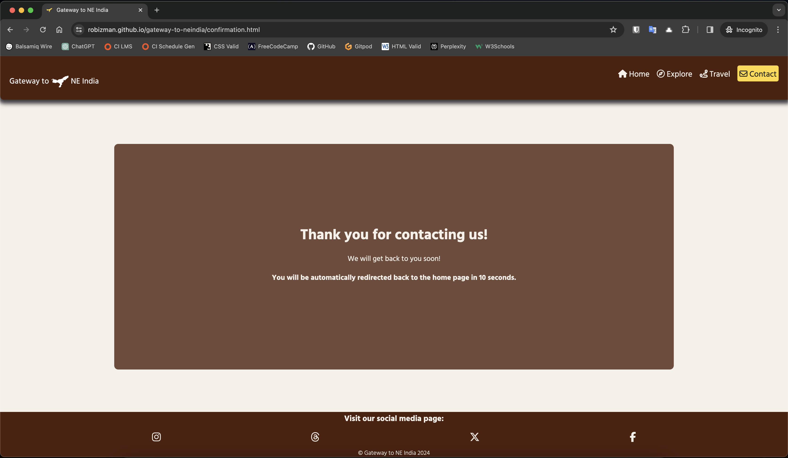 | 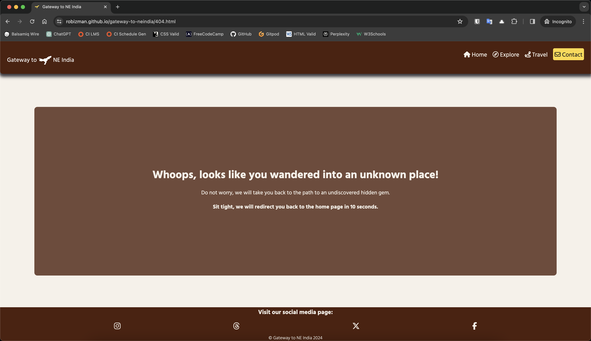 | Works as expected |
| Brave |  | 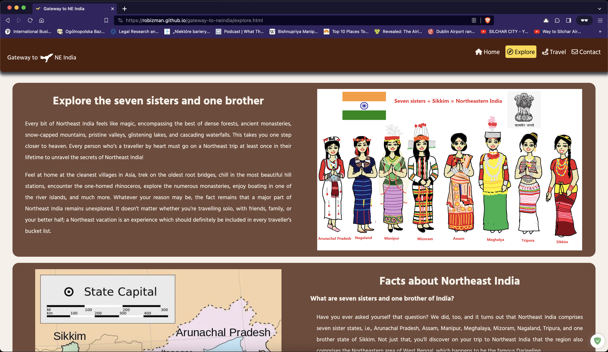 | 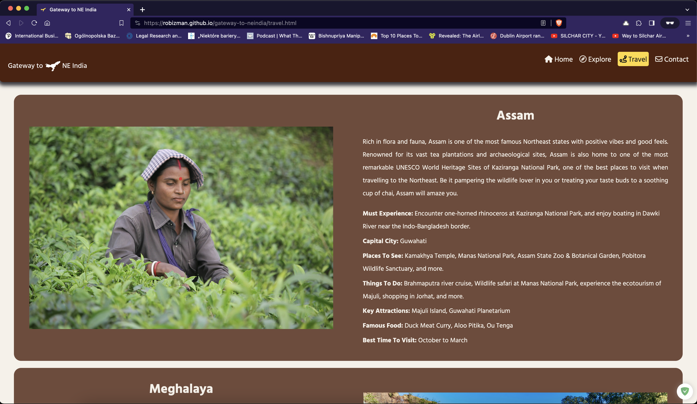 | 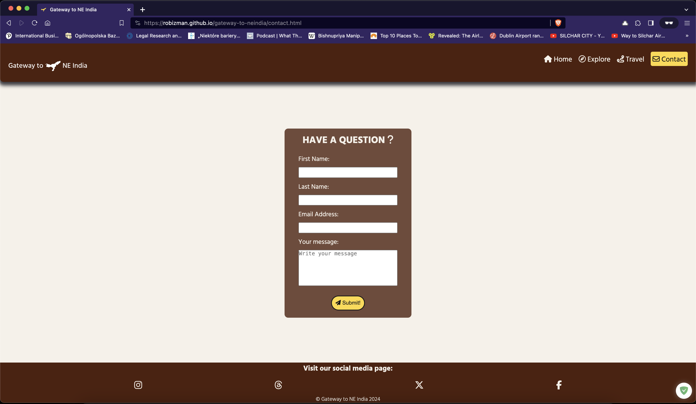 | 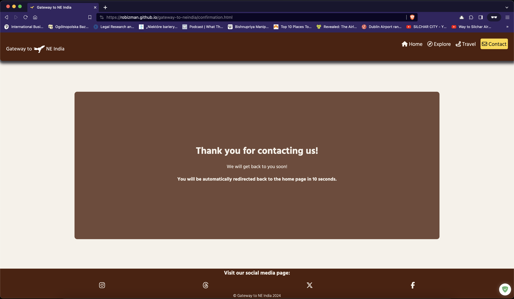 | 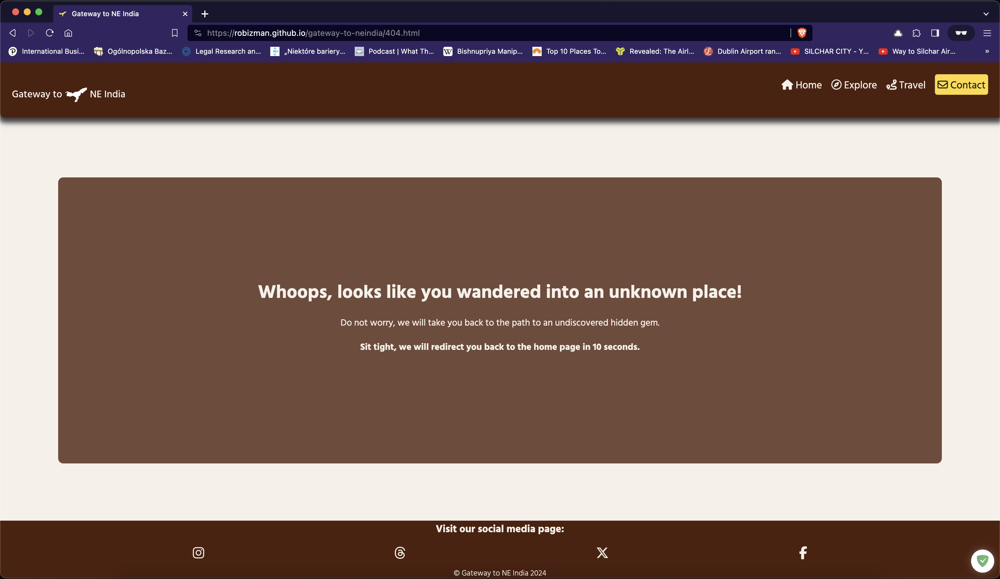 | Works as expected |
| Safari |  | 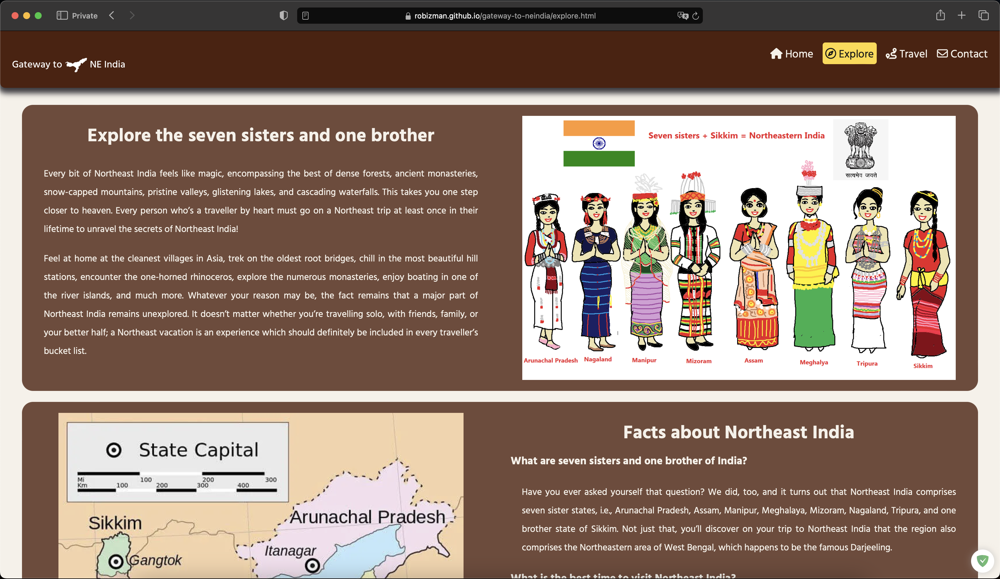 | 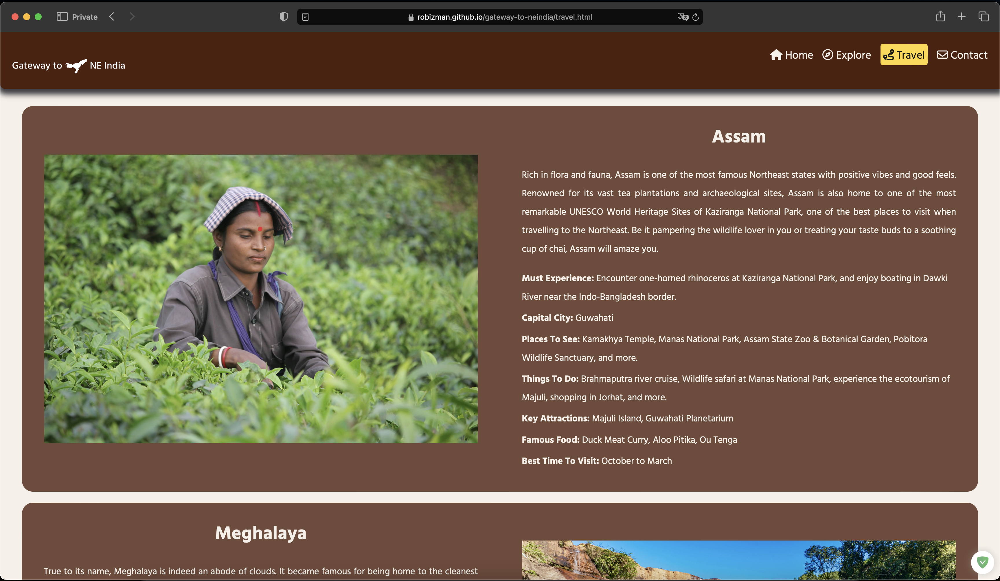 | 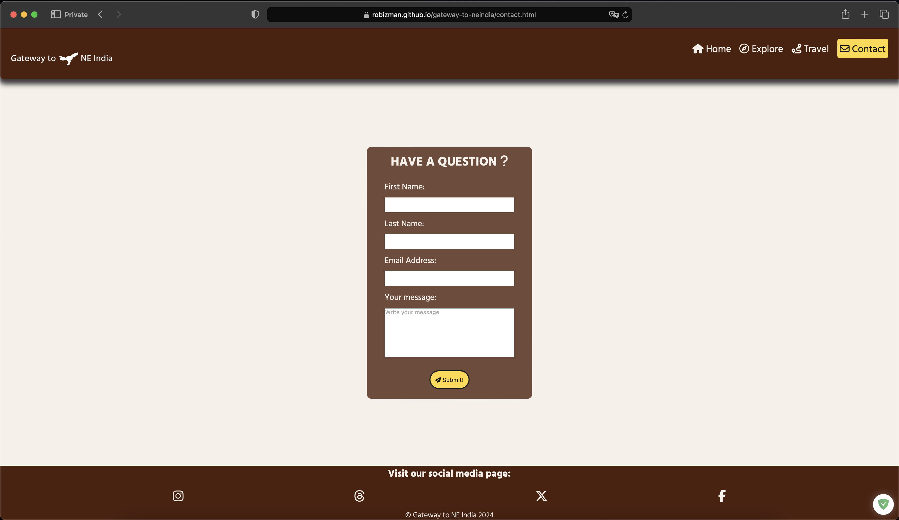 | 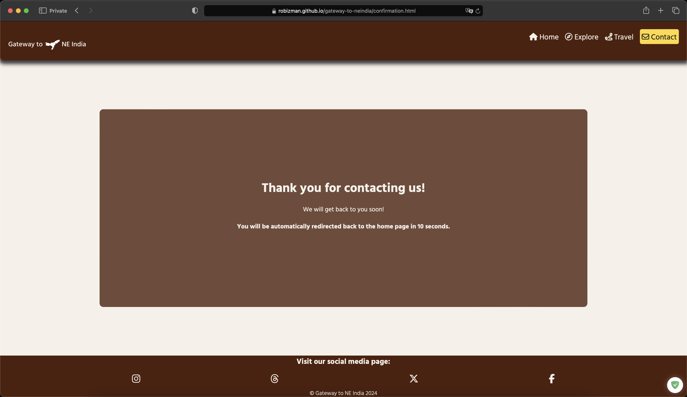 | 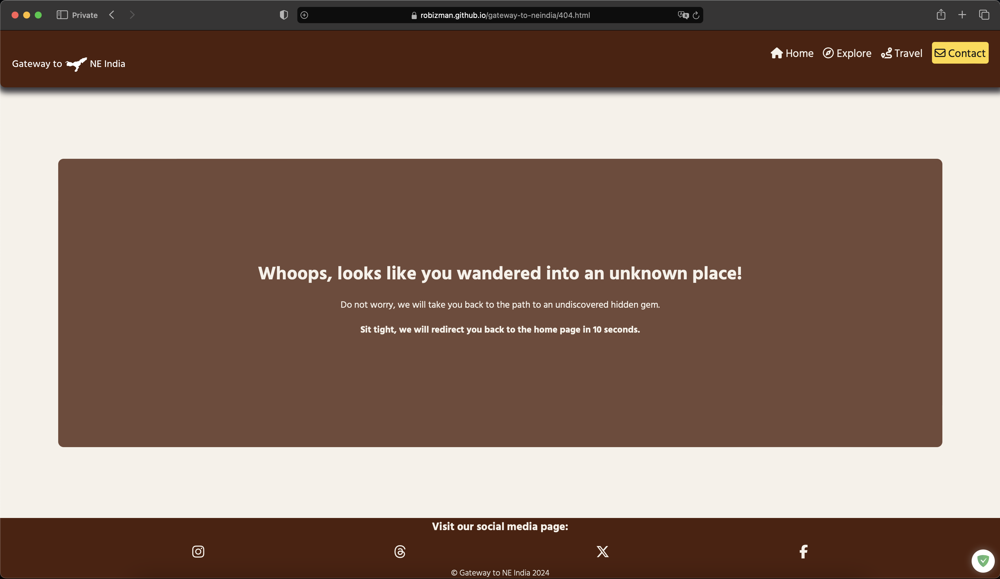 | Works as expected |

